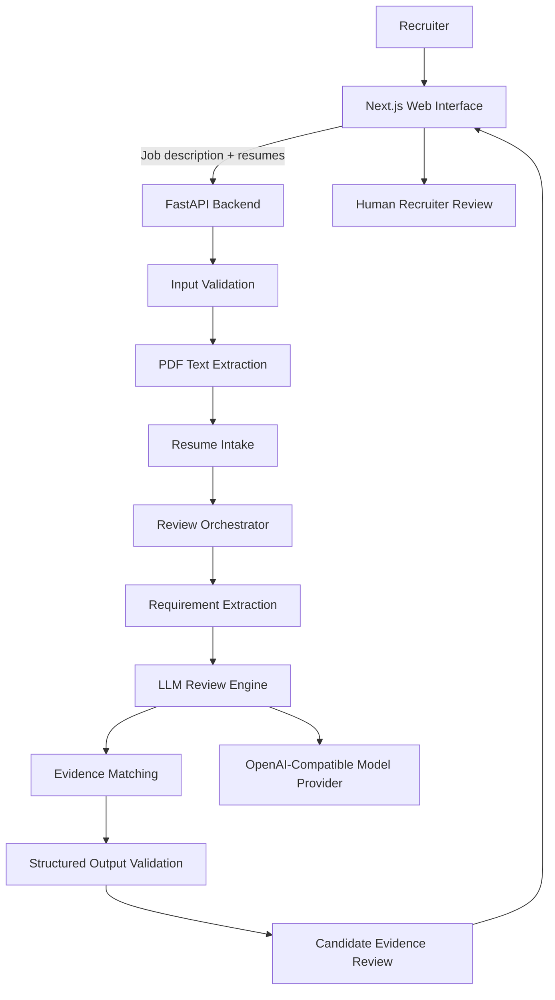

# AI Resume Review OS Mini

An AI-assisted recruiter workflow that compares candidate resumes against job requirements and produces a structured, evidence-based review for human assessment.

The system is designed to reduce the repetitive work involved in reading resumes, locating relevant experience, identifying gaps, and preparing consistent review notes.

> **The AI assists the review process. It does not make hiring or rejection decisions.**

---

## Problem

Recruiters repeatedly compare resumes against job descriptions by manually:

* reading candidate experience and skills;
* searching for evidence related to each requirement;
* identifying missing or unclear information;
* switching between resumes and job descriptions;
* preparing review notes for hiring teams.

This project turns that repetitive workflow into a small AI-assisted operating system that a non-developer can run through a web interface.

---

## What It Does

A recruiter provides:

1. a job description;
2. one or more candidate resumes.

The system then:

1. extracts readable text from uploaded PDFs;
2. identifies job-relevant requirements;
3. compares each resume against those requirements;
4. identifies supporting evidence;
5. highlights missing or unclear information;
6. generates a structured candidate review;
7. presents the result for human assessment.

The final decision remains with the recruiter or hiring manager.

---

## Architecture



### Core flow

```text
Job Description
      +
Candidate Resume
      ↓
Input Validation
      ↓
PDF/Text Extraction
      ↓
Requirement Identification
      ↓
AI Evidence Matching
      ↓
Structured Validation
      ↓
Evidence-Based Candidate Review
      ↓
Human Assessment
```

---

## Repository Structure

```text
resume-parser/
├── backend/
│   ├── app/
│   │   ├── config.py
│   │   ├── pdf_text.py
│   │   ├── resume_intake.py
│   │   ├── schemas.py
│   │   ├── auth.py
│   │   ├── main.py
│   │   └── routers/
│   │       ├── screenings.py
│   │       └── auth.py
│   │
│   ├── orchestrator/
│   │   └── resume_orchestrator.py
│   │
│   ├── agents/
│   │   └── screening_agent.py
│   │
│   └── tests/
│
└── frontend/
    └── Next.js recruiter interface
```

---

## Tech Stack

### Backend

* Python
* FastAPI
* Pydantic
* PDF text extraction
* OpenAI-compatible LLM API

### Frontend

* Next.js
* TypeScript

### AI Layer

The backend uses an OpenAI-compatible model provider to analyze job requirements and resume evidence.

The AI is responsible for information extraction and evidence organization, not final employment decisions.

---

## Quick Start

### 1. Start the backend

```bash
cd backend

uv sync
uv run main.py
```

Backend:

```text
http://127.0.0.1:8000
```

API documentation:

```text
http://127.0.0.1:8000/docs
```

---

### 2. Start the frontend

In another terminal:

```bash
cd frontend

npm install
npm run dev
```

Frontend:

```text
http://localhost:3000
```

---

## Configuration

Create a `.env` file in `backend/`.

Minimum configuration:

```env
OPENROUTER_API_KEY=your_api_key
OPENAI_MODEL=your_model_id
```

The application also supports:

```env
OPENROUTER_BASE_URL(OPENAI_API_KEY)=
CORS_ORIGINS=
CORS_ORIGIN_REGEX=
APP_NAME=
ENVIRONMENT=
AUTH_SECRET=
```

Optional processing settings include:

```env
MAX_RESUME_FILES=
MAX_FILE_SIZE_MB=
MAX_PDF_PAGES=
MAX_RESUME_CHARS=
SCREENING_CONCURRENCY=
SCREENING_DELAY_SECONDS=
LLM_TEMPERATURE=
AUTH_TOKEN_TTL_HOURS=
```

See `backend/app/config.py` for defaults.

---

## API

### `POST /api/v1/screenings`

Processes one job description against one or more resumes.

Content type:

```text
multipart/form-data
```

### Inputs

| Field                  | Type   | Required                           |
| ---------------------- | ------ | ---------------------------------- |
| `resumes`              | PDF[]  | Yes                                |
| `job_description_file` | PDF    | One job-description input required |
| `job_description_text` | String | One job-description input required |
| `position_title`       | String | No                                 |

Provide either `job_description_file` or `job_description_text`, not both.

### Example

```bash
curl -X POST http://127.0.0.1:8000/api/v1/screenings \
  -F "job_description_file=@senior-ml-engineer.pdf" \
  -F "resumes=@candidate-one.pdf" \
  -F "resumes=@candidate-two.pdf"
```

---

## Intended Review Output

The target v1 output is evidence-oriented rather than decision-oriented.

Example:

```json
{
  "candidateId": "cand-001",
  "requirements": [
    {
      "requirement": "Python",
      "status": "evidence_found",
      "evidence": "8 years of experience building Python services."
    },
    {
      "requirement": "Kubernetes",
      "status": "no_evidence_found",
      "evidence": null
    },
    {
      "requirement": "Production ML pipelines",
      "status": "partial_evidence",
      "evidence": "Led ML pipeline development at previous employer."
    }
  ],
  "missingInformation": [
    "No explicit Kubernetes experience identified."
  ],
  "summary": "The resume contains relevant Python and ML platform experience, while some infrastructure requirements are not explicitly demonstrated.",
  "reviewStatus": "human_review_required"
}
```

### Important distinction

`no_evidence_found` means:

> the supplied resume does not contain sufficient evidence.

It does **not** mean:

> the candidate does not possess the skill.

---

## Error Handling

The system should distinguish an unsuccessful AI or document-processing operation from an actual candidate assessment.

For example:

```json
{
  "candidateId": "cand-002",
  "status": "processing_error",
  "assessment": null,
  "error": "The resume could not be processed."
}
```

A provider timeout or unreadable document must never be represented as a low candidate score.

---

## Partial Batch Processing

If one uploaded resume cannot be processed, other valid resumes can continue through the workflow.

Examples of rejected inputs include:

* corrupt PDFs;
* password-protected PDFs;
* unsupported files;
* documents containing no readable text.

Rejected files are reported separately from successfully processed candidates.

Scanned PDFs currently require OCR and are outside the initial scope.

---

## AI Safety and Human Oversight

This project is designed as a **recruiter assistance tool**.

The AI should:

* identify job-related requirements;
* locate supporting resume evidence;
* identify missing information;
* flag ambiguity;
* generate consistent review summaries.

The AI should not:

* automatically hire candidates;
* automatically reject candidates;
* make decisions based on protected characteristics;
* infer sensitive personal characteristics;
* verify whether resume claims are truthful;
* replace recruiter or hiring-manager judgment.

All AI-generated assessments require human review.

---

## Evaluation

The system is evaluated against a fixed test set containing representative, edge, and failure scenarios.

Key metrics include:

| Metric                              | Purpose                                                          |
| ----------------------------------- | ---------------------------------------------------------------- |
| Review time                         | Measure workflow efficiency                                      |
| Requirement identification accuracy | Measure whether relevant criteria are detected                   |
| Evidence accuracy                   | Measure whether findings are supported by resume text            |
| Missed evidence                     | Detect relevant information the system overlooked                |
| Unsupported claims                  | Detect conclusions not supported by the resume                   |
| Structured-output success           | Measure response reliability                                     |
| Failure handling                    | Ensure technical errors are not treated as candidate assessments |


---

## Test Scenarios

The evaluation set should cover at least:

* candidate with clear evidence for most requirements;
* candidate missing several requirements;
* partially demonstrated requirement;
* equivalent or related technology;
* long resume;
* unusual job title;
* evidence appearing only inside project experience;
* conflicting resume information;
* empty resume;
* unreadable document;
* prompt-injection instructions embedded inside a resume;
* AI provider timeout or malformed response.

Run the automated test suite with:

```bash
cd backend
uv run pytest
```

Tests do not require a live model provider where provider behavior is stubbed.

---

## Authentication

Basic authentication endpoints exist to support the frontend development workflow.

They are currently **development placeholders**, not production-grade authentication.

Before production use, the authentication layer would require improvements including:

* secure deployment secrets;
* token revocation;
* persistent database-backed users;
* rate limiting;
* password recovery;
* email verification;
* stronger session management;
* authorization enforcement on screening endpoints.

---

## Current Scope

This focuses on one workflow:

> **Job description + candidate resume → evidence-based AI review → human assessment**

### Included

* job-description input;
* resume PDF upload;
* text extraction;
* AI-assisted requirement analysis;
* structured candidate review;
* evidence identification;
* missing-information detection;
* batch processing;
* failure handling;
* recruiter-facing web interface;
* repeatable evaluation.

### Out of scope

* autonomous hiring;
* automatic rejection;
* candidate ranking as a hiring decision;
* interview automation;
* background verification;
* complete ATS integration;
* OCR for scanned documents;
* enterprise authentication;
* model fine-tuning.

---

## Future Direction

A later version may retrieve candidates directly from an external applicant tracking or job-board system rather than requiring manual uploads.

The existing job-board client is intended as an integration path:

```text
Job Board / ATS
      ↓
Candidate Retrieval
      ↓
Shared Review Pipeline
      ↓
Structured Recruiter Review
```

---

# frontend

Next.js interface for the screening API in [`../backend`](../backend). App
Router, TypeScript, Tailwind CSS v4. No state library and no data-fetching
library — the app has one long-running request and one user record, both of
which fit in component state.

## Setup

```bash
npm install
cp .env.example .env.local   # already present; edit if the API moved
npm run dev
```

Runs on <http://localhost:3000>. The backend must be running too, and its
`CORS_ORIGINS` must include whichever origin you open the app at.

`http://localhost:3000` and `http://127.0.0.1:3000` are different origins to a
browser. The backend allows both, plus any loopback port while
`ENVIRONMENT=development`, so opening either spelling — or `:3001` when Next
falls back to it — works. If you do hit a CORS error, check the origin in the
browser's address bar against `CORS_ORIGINS` in `backend/.env`; a blocked
request looks like a network failure even though the API answered normally.

| Variable | Purpose |
| --- | --- |
| `NEXT_PUBLIC_API_BASE_URL` | Origin of the FastAPI backend. Defaults to `http://127.0.0.1:8000`. |

`NEXT_PUBLIC_` is required: the calls are made from the browser, so the value
is inlined into the client bundle at build time and is not a secret.

## Routes

| Route | Auth | What it is |
| --- | --- | --- |
| `/` | public | Landing page. |
| `/signup`, `/login` | public | Redirect to `/dashboard` if a valid token is already stored. |
| `/dashboard` | required | Screening panel and the latest results. |
| `/dashboard/settings` | required | Profile, screening defaults, theme. |

## The screening flow

`Screen candidates` opens a slide-over (`components/screening-pane.tsx`) with
three steps:

1. **Resumes** — drag-and-drop or browse, multiple PDFs, accumulating across
   picks. Non-PDFs, empty files, and anything over 10 MB are rejected inline
   with a reason; duplicates are dropped by name/size/mtime.
2. **Job description** — a two-tab control, *paste text* or *upload PDF*. The
   tabs are exclusive because `POST /screenings` returns 422 if both
   `job_description_text` and `job_description_file` are sent.
3. **Position title** — optional; prefilled from the user's saved default.

`Send for screening` posts the batch as `multipart/form-data`. The pane stays
open with a progress state and a working **Cancel** (an `AbortController`),
because a full batch takes roughly one model round-trip per candidate plus a
ranking call.

Results render into `components/results-view.tsx`: the ranked list with
per-candidate scores, matched skills, concerns, and the model's justification.
Files the backend could not read come back in `rejectedFiles` and are shown as
a warning rather than being hidden.

Results are **not persisted** — they live in component state for the session.
Reloading the dashboard clears them.

## Layout

```
app/
  layout.tsx                  fonts, AuthProvider, pre-paint theme script
  page.tsx                    landing
  globals.css                 design tokens (light/dark) + .btn/.field/.card
  (auth)/layout.tsx           split-screen shell for the two auth pages
  (auth)/login/page.tsx
  (auth)/signup/page.tsx
  dashboard/layout.tsx        auth guard + header (profile, settings)
  dashboard/page.tsx          screening entry point + results
  dashboard/settings/page.tsx
components/
  screening-pane.tsx          the slide-over; owns the POST
  resume-dropzone.tsx         multi-file PDF picker
  job-description-input.tsx   paste-or-upload tabs
  results-view.tsx            ranked list, expandable per candidate
  profile-menu.tsx            avatar dropdown: profile, settings, sign out
  avatar.tsx, alert.tsx, icons.tsx
lib/
  api.ts                      fetch wrapper, ApiError, endpoint methods
  auth-context.tsx            token + user, backed by localStorage
  types.ts                    mirrors backend/app/schemas.py
  screening.ts                joins the response's three per-candidate arrays
  limits.ts                   client-side mirror of the upload limits
  theme.ts                    light/dark application and pre-paint bootstrap
```

## Auth, and what it is not

The token from `/api/v1/auth/login` is kept in `localStorage` and sent as
`Authorization: Bearer`. That means:

- **The route guard is client-side** (`app/dashboard/layout.tsx`), not
  middleware — middleware runs on the server and cannot read `localStorage`.
  The dashboard renders a spinner until the stored token has been checked
  against `/auth/me`.
- **Signing out is a local discard.** The backend issues self-expiring tokens
  with no revocation list, so there is no session to end server-side.

Both follow from the placeholder auth in `backend/app/auth.py`. Moving to
httpOnly cookies plus real sessions would let the guard become middleware and
sign-out become a server call; until then this is deliberately the simple
version.

## Checks

```bash
npm run typecheck
npm run lint
npm run build
```
